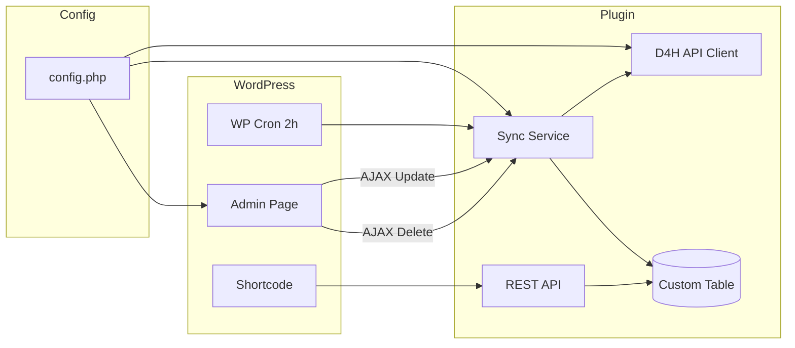

# D4H Calendar WordPress Plugin – Step-by-Step Plan

## Suggested Phases (Steps)

| Step  | Focus                            | Outcome                                                                        |
| ----- | -------------------------------- | ------------------------------------------------------------------------------ |
| **1** | Project skeleton + config        | Plugin bootstraps, folder structure, one config file for all variables         |
| **2** | D4H API client + storage         | Fetch events/exercises from API, store in custom DB table, respect config      |
| **3** | Cron + admin page (no UI polish) | 2-hour cron, “Update now” (AJAX), “Last updated” and “Delete >90 days” (AJAX)  |
| **4** | Frontend calendar                | Shortcode (or block) that outputs a calendar of stored events/exercises        |
| **5** | Polish + security                | Nonces, capability checks, sanitization, optional cleanup of cron on uninstall |

This keeps each step testable and avoids doing “everything at once.” Steps 1–3 give you a working sync and admin; step 4 adds the public calendar; step 5 hardens the plugin.

---

## API and Data Model (Reference)

- **D4H Team Manager API v3**: [API docs](https://api.team-manager.us.d4h.com/v3/docs) (base URL you gave: `https://api.team-manager.us.d4h.com`).
- **Auth**: Bearer token (Personal Access Token). **Credentials are saved via the admin menu** (settings form storing token and optional context/contextId in WordPress options); never commit tokens to the repo.
- **Endpoints** (context = `team` or `organisation`, contextId from `/v3/whoami`):
  - List events: `GET /v3/{context}/{contextId}/events` (paginated, query params e.g. `starts_after`, `ends_before`, `page`, `size`).
  - List exercises: `GET /v3/{context}/{contextId}/exercises` (same pattern).
- **Relevant fields**: `id`, `resourceType` (Event/Exercise), `startsAt`, `endsAt`, `reference`, `referenceDescription`, `description`, `address`, etc. Use `startsAt`/`endsAt` for calendar and for “older than 90 days” deletion.

---

## Step 1: Project Skeleton and Config

**Goal**: Plugin loads, has a clear structure, and all “magic values” live in one place.

- **Plugin root**: e.g. `d4h-calendar/` with main file `d4h-calendar.php` (plugin header, no logic beyond loading bootstrap).
- **Suggested structure** (modular, PSR-4-style or simple includes):
  - `config.php` or `includes/config.php` – **single config file** with:
    - API base URL (e.g. `https://api.team-manager.us.d4h.com`)
    - API version path (e.g. `/v3`)
    - Cron interval (e.g. 2 hours in seconds)
    - Retention days (e.g. 90 for “delete older than 90 days”)
    - Option names / DB table name prefix (so table name is config-driven)
    - Any feature flags (e.g. enable cron, enable delete button)
  - `includes/` – core classes:
    - Bootstrap/loader (e.g. `Plugin.php` or `Loader.php`) that runs on `plugins_loaded`, reads config, and wires the rest.
  - `includes/class-d4h-database.php` – create/return custom table name from config (actual schema in Step 2).
  - `includes/class-d4h-admin.php` – stub that registers the admin menu and page URL. In Step 1 the page can be minimal; in Step 3 it will also host the **API credentials form** (token, optional context/contextId) that saves to options.
- **Config style**: One array or constants in `config.php`; no secrets in repo. **API credentials (token, and optionally context/contextId) are saved from the admin menu**—add an “API Settings” or “Credentials” section on the plugin admin page with a form that saves to options (option keys defined in config). Sync and API client read token and context from these options.

**Deliverable**: Activating the plugin shows a new admin menu item; no API calls yet. All paths and config values come from the single config file.

---

## Step 2: D4H API Client and Storage

**Goal**: Reliably fetch events and exercises and store them in WordPress.

- **Config**: Add to config: option keys for API token and (optional) context/contextId—**all read from options set via the admin settings form**. If context is not stored, sync can call whoami (whoami URL in config) to get context.
- **API client** (`includes/class-d4h-api-client.php`):
  - Single responsibility: HTTP calls to D4H. Uses `wp_remote_get` (or `wp_remote_request`), base URL and paths from config.
  - Methods: e.g. `get_events( $context, $context_id, $args )`, `get_exercises( $context, $context_id, $args )` with optional `starts_after`/`ends_before`/`page`/`size` from config or args.
  - Handle pagination: loop until no more pages, merge `results` into one list per resource type.
  - Return decoded JSON or WP_Error; no DB writes inside this class.
- **Storage** (`includes/class-d4h-sync-service.php` or `class-d4h-repository.php`):
  - Create custom table (name from config) with columns: at least `id` (D4H id), `resource_type` (event/exercise), `starts_at`, `ends_at`, `payload` (JSON or key columns), `created_at`/`updated_at`. Schema in one place (e.g. `dbDelta` in a method or in `class-d4h-database.php`).
  - Methods: `replace_activities( $items )` (upsert by D4H id + resource type), `get_activities( $from, $to )`, `delete_older_than( $days )` (use `starts_at` or `ends_at` from config retention logic).
  - Option: store “last successful sync” timestamp in an option (key from config); update only after a full successful sync.
- **Sync orchestration** (can live in same class or a small `class-d4h-sync.php`):
  - One public method: “run full sync” (get context from config/whoami, fetch all events and exercises with pagination, then call `replace_activities` and update “last updated” option). Called by cron and by “Update now.”
- **Deliverable**: From admin or a temporary button, trigger sync once; table is filled and “last updated” is set. No cron yet.

---

## Step 3: Cron, Admin Page Actions, “Last Updated” and “Delete >90 Days”

**Goal**: Automated sync every 2 hours, and admin page with “Update now,” “Last updated,” and “Delete data older than 90 days.”

- **Cron**:
  - Register custom cron event on plugin load (or activation) using interval from config (e.g. 2 hours). Use `wp_schedule_event` and a unique hook name (e.g. `d4h_calendar_sync`).
  - Hook that event to the sync orchestration method (run full sync).
  - Register the custom interval with `cron_schedules` (e.g. `every_two_hours` => 7200) so it’s configurable (e.g. 7200 from config).
- **Admin page** (in `class-d4h-admin.php`):
  - **API credentials section**: Form to save API token and (optional) context/contextId to options (option keys from config). Submit via POST; validate and sanitize; show success/error. Sync and “Update now” use these stored credentials.
  - Render:
    - **Last updated**: Read timestamp from option (from config); display formatted (e.g. “Never” or “17 Feb 2026, 15:30”).
    - **Update now**: Button that triggers AJAX.
    - **Delete data older than 90 days**: Button that triggers AJAX (days from config).
  - **AJAX “Update now”**:
    - Registered with `wp_ajax`** (and optionally `wp_ajax_nopriv`** only if you ever need it; normally admin-only). Handler: run sync orchestration, then return JSON (e.g. `{ "success": true, "last_updated": "..." }`). Use nonce and capability check (e.g. `manage_options`).
  - **AJAX “Delete >90 days”**:
    - Handler: call `delete_older_than( 90 )` (90 from config), then return success/error. Same security as above.
  - Enqueue one small JS file on that admin page only: on button click, send AJAX request to the correct `admin-ajax.php` action, then update “Last updated” or show message (and optionally refresh “Last updated” after “Update now”).
- **Config**: Cron interval (seconds), retention days, option keys, and AJAX action names should all be in the single config file so they’re easy to change.
- **Deliverable**: Cron runs every 2 hours (or as configured); admin sees “Last updated,” “Update now,” and “Delete >90 days” working without full calendar UI.

---

## Step 4: Frontend Calendar (Public + FullCalendar)

**Goal**: **Public frontend** calendar that shows stored events and exercises using **FullCalendar**.

- **Data**: Use existing storage: `get_activities( $from, $to )` for the range the calendar needs (e.g. current month ±1). Expose via:
  - REST API endpoint (recommended): e.g. `GET /wp-json/d4h-calendar/v1/activities?from=...&to=...` returning JSON in a format FullCalendar can consume (e.g. `title`, `start`, `end`, `extendedProps.resourceType`). Use config for namespace and retention logic.
  - Or a PHP method called from the shortcode with a fixed range; keep the same `get_activities` API.
- **Shortcode** (e.g. `[d4h_calendar]`):
  - Renders a wrapper `div` (e.g. `#d4h-calendar`) and enqueues **FullCalendar** (core script + CSS from CDN or bundled), plus a small plugin script that initializes FullCalendar with the REST endpoint as the event source.
  - **FullCalendar**: Use the standard event source API (e.g. `eventSources` with a function or URL to the REST endpoint) so the calendar fetches activities for the visible date range. Map stored activities to FullCalendar events (title, start, end, optional color/label by `resource_type`).
  - Events vs exercises: different label or color (e.g. “Event” vs “Exercise”) using `resource_type`; configurable in config.
- **Config**: Add shortcode name, REST namespace, date range defaults, FullCalendar default view (e.g. dayGridMonth), and label/color overrides.
- **Deliverable**: Adding `[d4h_calendar]` to any page shows a **public** calendar of synced events and exercises using FullCalendar.

---

## Step 5: Security, Cleanup, and Small Fixes

**Goal**: Harden the plugin and avoid leaving traces.

- **Security**:
  - All AJAX handlers: nonce verification and capability check (e.g. `manage_options` for admin actions).
  - REST endpoint: permission_callback that allows public read for activities (or only for logged-in users if you prefer); no write.
  - Escape output in admin and shortcode; sanitize and validate any input (e.g. `from`/`to` as dates).
- **Cron on uninstall**: In `uninstall.php` (or register with `register_uninstall_hook`), clear the scheduled cron event (same hook name from config) so the job doesn’t keep running after plugin deletion.
- **Config**: API token is stored only in options (set via admin form); keep all other knobs in the single config file.

---

## Architecture Overview

---

## File and Config Summary

- **Single config file** (e.g. `includes/config.php`): API base URL, API path, **option keys for credentials** (token, context, contextId—all saved from admin form), cron interval (seconds), retention days, table name prefix, option keys (last updated, etc.), shortcode name, REST namespace, FullCalendar default view. All variables that might change per environment or requirement should be here.
- **Admin credentials form**: On the plugin admin page, a settings section (or tab) where the user enters API token and optionally context/contextId; save to options (keys from config). Sync and API client read from these options.
- **Modular classes**: Loader, Database (schema + table name), API Client, Sync/Repository, Admin (menu + page + **credentials form** + AJAX handlers), Shortcode, REST controller, FullCalendar front-end script. Each class receives config (array or object) from the bootstrap so nothing is hardcoded.

---

## Clarifications (Resolved)

1. **Calendar placement**: **Public frontend** via shortcode (default).
2. **API credentials**: **Saved from the admin menu**—settings form on the plugin admin page stores token (and optional context/contextId) in options; no credentials in config or repo.
3. **Calendar library**: **FullCalendar** (initialise with REST endpoint as event source; default view configurable in config).